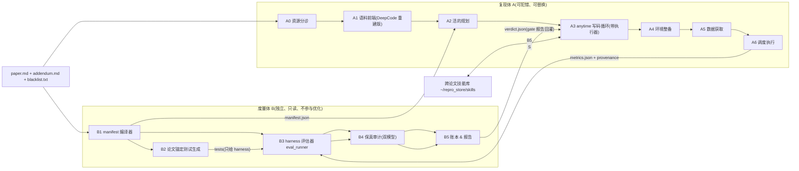

# 论文复现 Agent 架构 v0.2(最优版,交接文档)

> 2026-09-03。本文是**给另一个对话直接使用的交接文档**:不依赖任何对话上下文,所有事实带路径。
> 与 v0.1(`ARCHITECTURE_PROPOSAL_v0.1.md`)的关系:v0.1 为"周末跑通"做了大量妥协(桩、串行、手写 manifest);
> v0.2 去掉全部时间约束,按最优设计给出目标形态与建造顺序。**两者不冲突:v0.1 是 v0.2 的第一个里程碑的降配版。**

---

## 0. 你需要先知道的事实(全部有据可查)

### 0.1 这个项目是什么
用户在**从 0 到 1 自建论文复现 agent**:论文 → 环境 + 代码 → 数据集 → 按需调度 CPU/GPU 复现 → 结果。
硬约束:**不能接 Claude Code 壳、没有 Anthropic API**;模型只走 **Paratera** 的 OpenAI 兼容端点(`https://llmapi.paratera.com/v1`,清华算力券)。
DeepCode(HKUDS,arXiv:2512.07921)是目前唯一有成果可参照的同类开源项目,我们已对它做了两周的独立验证。

### 0.2 验证 DeepCode 得到的、必须据此设计的证据
公开仓库:https://github.com/2UBBISH/deepcode-paperbench-validation(本机:`/home/deepevol/deepevol/deepcode_test/`)。先读 `release/README.md` §1。

| 事实 | 出处 | 对设计的含义 |
| --- | --- | --- |
| 同底座双切(DeepSeek-V4-Pro),PaperBench Code-Dev:fre 两裁判 serving 都无增益(0.98× / 0.81×);rice 随裁判 serving 翻转(1.05× ↔ 2.58×);JudgeEval 上两裁判同等准确(F1 0.685 / 0.719)却有 16% 叶级分歧 | `docs/FINDING_judge_serving_dependence.md` | **LLM 裁判分不能做目标函数**;主指标必须是执行级;任何分数带 serving 标签 |
| fre 失分 = 规划器一次定死文件树、漏掉全部对比基线;rice 失分 = 广度换深度;两篇共同点 = 写码全程不执行不验证(`command_executor` 零调用) | `docs/CONCLUSIONS.md` §⑥、`fre/RESULTS.md`、`rice/RESULTS.md` | 规划必须是活文档;执行验证必须在循环内;深度按优先级分配 |
| 预算是常量(`_MAX_ITERATIONS=800`、墙钟)不随计划规模变;每文件 clean-slate 内存;索引模式只给 2 个工具 | `DeepCode/workflows/code_implementation_workflow.py:78,90,989` | 预算随计划走;单场连续对话 + 外置记忆;工具面完整 |
| 四种"LLM 输出超限/为空 → 静默当正常继续"降级:预筛截断、挖掘报告截断、预筛空列表、判分文件选择空 | `docs/FINDING_prefilter_silent_failure.md` | 每个 LLM→程序接缝显式校验,失败即失败 |
| 我们对 DeepCode 的修复轮(覆盖审计/解冻文件树/写后编译)基线补上了但主方法下滑,且提示词含评分元知识被作废 | `docs/REVIEW_local_changes_2026-09-03.md`、`fre/RESULTS.md` §3g | 度量信息不得进入复现体;修正只能增量不能整体重生成 |
| 裸跑 agent(Claude Code 壳 + 同模型)0.47,与 DeepCode 相当且快 5~10 倍;赢在增量规划、写后执行、多趟、自主取舍 | `docs/CONCLUSIONS.md` | 这就是要自建的循环的样子 |
| DeepCode 唯一可验证的长处 = 覆盖面(参考仓库挖掘 + CodeRAG 使环境/数据集维度普遍占优) | `rice/RESULTS.md` §5、`fre/RESULTS.md` §3 | 前半段值得重建为语料前端 |
| AutoSOTA(清华 FIB,arXiv 2604.05550):执行结果判定、iteration-0 实测基线、评测脚本哈希锁、失败签名、外层监督;作者自认 16% "成功"是无效优化;CVPR 4045 篇仅 1.1% 成功、88% 死在资源可得性;ICML 最大失败点是复现阶段 | `docs/ARCHITECTURE_PROPOSAL_v0.1.md` §5 | 度量权与复现体分离;资源分诊先于一切;红线落在代码层 |
| 组内轮间摆动 0.13~0.16,每组 2 轮分不出任何小效应 | `docs/CONCLUSIONS.md` §⑦ | 对照 n≥5;预注册;留出集 |

### 0.3 环境与资产(本机)
- 硬件:WSL2,物理内存 15.7GB,**WSL 当前只给 7GB**(`/mnt/c/Users/43519/.wslconfig` 缺 `[wsl2] memory=` 行,建议 `memory=10GB swap=8GB` 后 `wsl --shutdown`);RTX 4060 Laptop 8GB;Docker 已注册 nvidia runtime,`--gpus all` 可见 GPU;镜像 `pb-env:latest` 可作基底。
- Paratera 模型表(2026-09-03 核实,共 93 个):DeepSeek-V4-Pro / V4-Flash、Kimi-K2.5 / K2.6 / K3、GLM-5 / 5.1 / 5.2 / 5.3、Qwen3.5~3.8 系列。**没有 Kimi-K2.7-Code、没有 Qwen3-Coder-Plus。** Paratera 实测 30 分钟零异常、白天无限流。
- 配置:`~/.deepcode/deepcode_config.json`(provider=paratera,model=DeepSeek-V4-Pro,maxTokens=65536)、`~/.deepcode/credentials.json`(key,勿回显)。
- DeepCode 修改版源码:`/home/deepevol/deepevol/DeepCode/`(上游 `e0767d0` + `deepcode_test/patches/deepcode_local_changes.patch`,15 处未门控改动见 REVIEW 文档)。
- PaperBench:`/home/deepevol/deepevol/frontier-evals/project/paperbench/`;论文资产 `data/papers/<id>/{paper.md, addendum.md, blacklist.txt, rubric.json}`(本地 23 篇);判分脚本 `deepcode_test/scripts/run_grade.sh`;复现脚本 `deepcode_test/scripts/run_trial.sh`(含假计划闸/状态闸/摆卷核验,可整段搬用)。
- 可直接复用的种子与语料:rice 代码种子 `deepcode_test/rice/submissions/trial2/`;rice 语料归档 `deepcode_test/rice/task_archives/archive_task_paper_ddaecdf1_0830_0724/`(`planning_result_meta.json` source=generated、5 个参考仓库、`indexes/` 齐全);fre 归档在 `deepcode_test/fre/task_archives/`。
- 坑清单:`docs/PAPERBENCH_RUNBOOK.md`(13 坑)、`docs/CLEAN_E2E_PLAN.md`(D1–D5,含 Kimi 对含连字符工具名静默不调用)。
- 新代码位置约定:`/home/deepevol/deepevol/repro/`(Python 包 `repro`,py3.12,与 DeepCode 的 3.11 venv 分离);运行目录 `~/repro_runs/<paper>/<run_id>/`;共享存储 `~/repro_store/{datasets,models,repos,skills,images}/`。

---

## 1. 设计原则(五条,违反任何一条都应被 review 拦下)

1. **度量权与复现体分离**:计算最终指标、判定主张、审计保真的代码与模型调用,不得看到复现体的对话上下文;复现体的代码不得计算最终指标。
2. **执行级为主指标**:能不能装、能不能跑、指标是否按论文方向、差异是否超过噪声;LLM 裁判分只做审计,永远带 serving + 模型标签。
3. **重要性只来自论文本身**:贡献声明、方法节、主实验表;任何评分表(rubric)信息物理不进工作区,CI 强制 grep。
4. **没有静默降级**:每个 LLM→程序接缝校验 `finish_reason`、长度、JSON 闭合、空返回;失败即显式失败;所有降级留痕并使该轮不计入统计。
5. **规划是活文档,预算随规模走**:文件树可增量修订(禁整体重生成);迭代与墙钟按组件数 × 优先级分配;预算耗尽时砍附录不砍主方法。

---

## 2. 总体架构:两个互不见面的子系统

**接口只有三份文件**:`manifest.json`(B 产 A 读)、`metrics.json`(A 产 B 验,含 `provenance`)、`verdict.json`(B 产;其中 gate 报告可回灌 A3 作为下一轮输入)。

---

## 3. 度量体 B(先建,因为其它一切都要对着它优化)

### B1 manifest 编译器
- 输入白名单:`paper.md`、`addendum.md`、被引文献摘要(可选);`import_paper.sh` 复制时 `assert` 不存在 `rubric.json` / `judge/`。
- 多趟抽取(每趟独立调用,强模型):① 贡献与方法;② 实验网格(方法 × 环境/数据集 × 指标);③ 环境与数据集来源;④ 主张(statement / comparator / metric / expected_direction / paper_effect_sigma);⑤ 不可变约束(评测协议、数据划分、指标定义)。趟间交叉校验:主张引用的方法/指标必须在表内,否则重抽。
- 输出 `manifest.json`(schema `repro/schemas/manifest.schema.json`):
  `paper_id, category∈{rl_online, rl_offline, supervised, generative, analysis}, environments[{id, source, probe, needs_gpu}], datasets[{name, url, size, checksum?, verify_cmd}], methods[{name, role∈main|baseline, source}], metrics[{name, role∈primary|guardrail, direction, parse}], experiments[{id, grid, entry, scale_knobs}], claims[{id, statement, comparator, metric, expected_direction, paper_effect_sigma, scope}], constraints_immutable[], priority{component→rank}, gpu_hours_estimate`。
- 闸门 G0 `manifest_check`:schema;claims ≥1;每条 claim 的 `paper_effect_sigma ≥ 2` 否则 `not_testable_by_us`;黑名单域名不出现在任何 source;addendum 的 out-of-scope 条目映射到 `claims.scope`。
- 优先级规则(写进 manifest,供 A2/A3 用):贡献声明中的方法 > 主实验 > 对比基线 > 环境/数据 > 消融/附录。

### B2 论文锚定测试生成
- 由**非写码模型**从 manifest 为每个组件生成小测试:张量形状、公式在固定小输入上的数值、损失有限、数据划分比例、环境 `reset/step` 返回结构。
- 测试源码只存在 harness 侧(`~/repro_runs/<paper>/<run>/harness_tests/`),复现体看不到源码,只看到"通过/失败 + 失败断言的自然语言描述"。
- 这是 PaperBench 裁判噪声与 AutoSOTA "只验结果"盲区都碰不到的确定性判据。

### B3 harness 评估器 `eval_runner.py`
- 用 manifest 声明的**真实**环境/数据包独立加载 agent 的 checkpoint 回放算主指标;agent 自报的 `metrics.json` 只作对照。
- 硬闸:`metrics.json.provenance.env_module` 顶层包 ∈ `manifest.environments[].source`,不得来自 `submission/`。
- 多 seed:iteration 0 与最终各 ≥3 seed;`claims.pass` 要求差异 > 2 × 合并 std,且方向与论文一致。

### B4 保真审计
- 两个**不同**裁判模型(Paratera:DeepSeek-V4-Pro + GLM-5.3 或 Qwen3.8-Max)独立读 `git diff _seed.._final` + manifest,判"方法是否是论文的方法"(损失、切分、评测协议、关键模块)。一致才 pass,不一致 `uncertain` 进人工队列;分歧率作为噪声底长期监测。
- 静态审计项(只报告不判红):顶层类名匹配 `(Simulat|Simplif|Mock|Fake|Placeholder)`、继承 `gym.Env` 却不调用任何声明的第三方包、硬编码绝对路径、`reproduce.log` 出现 `NotImplementedError|Traceback`。
- `protected_paths.sha256`:smoke 首次通过后锁 `reproduce.sh`、评测入口、指标写出模块;S5 前校验,不符 exit 9 不入账(AutoSOTA `record_score.sh` 做法)。

### B5 账本与报告
- `scores.jsonl`:iteration 0 = 实测基线(`baseline_source ∈ {measured_by_us, paper_reported, mixed}`、`scale`、`eval_scope`、seeds、std);best-iterate 与 mean-of-reruns 分列。
- `verdict.json`:`stages[]{name, status, wall, cost}`、`env_ready`、`smoke_pass`、`resources_verified`、`coverage`(manifest 网格有 metrics 行的比例)、`claims[]{id, status∈pass|fail|na, reason}`、`audit{verdict∈real|uncertain|invalid, items[]}`、`failure_category`(九类:Missing Repo / Incomplete Repo / Non-Method Paper / Missing Data / Setup Failed / Insufficient Resources / No Improvement / Succeeded / Missed Claims)、`judge_scores[]{serving, model, score}`(仅审计)。
- 报表强制:成功率 = 成功 / 尝试;median + IQR;带分母的漏斗;每篇的模型 / 硬件 / 墙钟 / token 成本。

---

## 4. 复现体 A

### A0 资源分诊(花 token 之前)
- 只读 paper.md + addendum:有无官方实现(黑名单只用于**禁止**,不用于获取)、数据/权重可下载性(HEAD / Range 探测)、许可证、`gpu_hours_estimate ≤ 阈值`(超出 → 缩子集并记 `scope_reduced`)。
- 输出 `triage.json`;不可做的直接进 `failure_category`,不进入后续阶段。

### A1 语料前端(DeepCode 前半段重建版)
- 复用/重建对象与源文件:参考挖掘与下载(`DeepCode/workflows/agent_orchestration_engine.py` Phase 5–7)、CodeRAG 索引(`DeepCode/tools/code_indexer.py`,预筛在 `:558/:566`)、检索(`DeepCode/tools/code_reference_indexer.py:69/179/243`)、文档分段(`DeepCode/workflows/agents/document_segmentation_agent.py`)。
- 必改契约:报告/预筛/下载的 `max_tokens` 随输入规模算;截断、空列表、JSON 残缺 = 显式失败;下载数量与提名数量对账(`reference.txt` rank 数 = `github_download.txt` success 数,否则告警);索引幂等;预筛提示词的领域句(`code_indexer.py:558` "recommendation systems…")改为注入 manifest 关键词;`codebase_index_workflow.py:196-241` 的 `target_structure` 改为从 manifest 注入而非依赖 `initial_plan.txt`。
- 产物契约:`reference.txt`、`github_download.txt`、`indexes/*_index.json`、`document_segments/`,全部落盘并带 `meta.json`(来源、数量、失败项)。

### A2 活的规划
- 输入 manifest + 语料;输出 `plan.yaml`:文件树 + 组件依赖图 + 每个组件的优先级(来自 manifest.priority)+ 预期行数级别。
- 修订只允许**增量**(`plan_amendments.jsonl`:add / split / downgrade(仅 baseline 且给理由));禁止整体重生成;`role=main` 组件不可删。
- 覆盖检查:manifest 的方法 × 环境网格里每个单元在 plan 中有归属文件,否则列为缺口(不用任何权重信息)。

### A3 anytime 写码循环(核心,自建)
- 运行时:纯 `openai` SDK `chat.completions` + tools,单场连续对话,外置记忆(`notes/code_map.md` 首轮必写、`notes/decisions.md`、`failures.jsonl`);上下文超预算时压缩最旧的工具轮为一句摘要。
- 工具面(名字只含 `[a-z_]`):`read_file / list_tree / grep_code / write_file / apply_patch(唯一匹配) / run(容器内,timeout≤1800) / run_gate(name) / search_refs(A1 索引) / propose_plan_amendment / record_decision / done`。
- 两趟策略:**趟 1 骨架**——所有组件可导入、入口 `--help` 通过;**趟 2 加深**——按优先级逐组件"写 → 编译 → 锚定测试(B2,只见结果)→ 集成冒烟",预算耗尽时未加深的只剩附录级组件。
- `done` 不采信:自动跑 `smoke.sh`(干净容器),gate 报告回灌为下一条 user 消息;闸门阶梯固定 compile → import → `--help` → `SCALE=smoke reproduce.sh` → `metrics.json` schema → `env_module` 核验 → 静态审计项。
- 失败签名账本:traceback 归一化(去路径/行号/哈希/版本)取最后异常 + 末 3 帧;同签名已试修法禁止重复;第 3 次注入"换策略",第 4 次写入 `blocked[]` 继续。
- 预算:`max_iter = base + k × Σ(组件权重)`(权重来自优先级,主方法组件权重最高);墙钟与费用熔断;monitor 外层进程做阶段推断、停滞检测(连续 N 轮无 write / gate 无进展)、五种动作(continue / inject_guidance / switch_model / rollback / terminate)。
- 红线在代码层:禁改评测逻辑、数据划分、指标定义、`reproduce.sh` 度量段;禁假环境;禁硬编码结果;禁删/降级 `role=main`。系统提示不含 rubric / 权重 / 裁判 / 评分等词(CI grep)。

### A4 环境整备
- 三路来源按可信度合并成 `env.lock.yaml`:参考仓库自带 `conda_env.yml` / `setup.py` > addendum 版本约束 > LLM 生成的依赖文本(实锤幻觉依赖、互斥版本、0 字节 requirements,只当候选)。
- 栈分层镜像:现代 RL(py3.11 + torch 2.4 cu121 + gymnasium + mujoco 3 + SB3 2)、老栈(py3.9 + mujoco210 + mujoco-py + d4rl + gym 0.23)、通用 py311;按 `manifest.category` 选。
- 解析回路:容器内真实 `pip install` 失败 → 签名 → 查 `skills/pip_failures.md` → 改 lock → 重烤;≤6 轮。
- 开发容器与干净容器不漂移:依赖变更必须回写 lock 重烤镜像;最终 smoke 与正式运行永远从镜像新起容器;`run_manifest.json` 记镜像 sha 与 lock sha。

### A5 数据获取
- 三类获取物(数据集 / 环境资产 / 第三方仓库)各自预飞:HEAD 或 Range 探测 → 磁盘预算 → 断点续传(`aria2c -c -x4`)→ sha256 / 文件数 → `verify_cmd`(load 一个 batch,shape / 条数)→ 落盘才 `available`。
- 失败 → `needs_upload` + `UPLOAD_REQUEST.md`(期望路径、格式、校验命令);用户上传后重跑同一 verify;格式适配脚本由 A3 生成并受 B2 测试约束。
- 路径契约:`-v ~/repro_store:/store:ro`、`REPRO_DATA_ROOT=/store`;代码禁止硬编码绝对路径(静态审计项)。
- 镜像候选:`hf-mirror.com`、清华 pypi、HF 上的 D4RL / Minari 镜像(格式需转换)。

### A6 调度执行
- `jobs/<id>.json` → `jobs/state.jsonl`(每次状态变更立即落盘)→ 执行器 `docker run --rm --gpus <set> --memory <n>g --shm-size 2g`;GPU 作业按卡互斥(单机 `flock`,多卡按 GPU 索引分配),CPU 作业并行上限;超时 kill 进程组;完成判据 = 产物存在且 schema 通过;重启进入 recovery(扫 state,`docker inspect` 判活,按 `outputs/` 推断终态)。
- `SCALE` 三档合同(`smoke` / `scaled` / `full`)写在 `reproduce.sh`;full 规模超本机能力时按 `gpu_hours_estimate` 生成租卡 job 模板(适配器接口:提交 / 轮询 / 取回产物)。
- PaperBench 执行合同兼容:submission 根目录 `reproduce.sh`、`reproduce.log`、`reproduce.log.creation_time`,使产物可直接进 Code Execution / Result Analysis 叶判分作外部对照。

---

## 5. 模型路由(全部 Paratera,四元组冻结:模型名 + serving + temperature + 提示词版本)

| 用途 | 模型 | 约束 |
| --- | --- | --- |
| B1 manifest 编译、B2 测试生成 | DeepSeek-V4-Pro(强) | 多趟独立调用,交叉校验 |
| A3 写码主力 | 探针选定的快模型(候选 Kimi-K2.6 / DeepSeek-V4-Flash / Qwen3.8-Max) | 连续 2 次同签名失败升级到 V4-Pro 一轮 |
| B4 保真审计 | 两个不同模型(V4-Pro + GLM-5.3 或 Qwen3.8-Max) | **审计模型 ≠ 写码模型**,避免自我一致 |
| 裁判审计(PaperBench Code-Dev,仅次指标) | V4-Pro + 第二模型 | 分数带 serving + 模型标签;历史 SiliconFlow 分数只存档 |
| 每次调用 | — | `finish_reason ∈ {stop, tool_calls}`;空 content 无 tool_calls 计空响应;tool_calls JSON 必须闭合;贴近 max_tokens 视为截断;任一不满足 = 显式错误重试;退避 `10/30/60/180/300s`;请求超时 600s |

---

## 6. 评测协议(对 agent 自身)

- **开发集** fre、rice(已被反复看过,只用于调试与回归);**留出集** 从 PaperBench 其余 21 篇只读 paper.md + addendum 分诊选 ≥3 篇(不同领域、8GB 可跑、≤4 GPU 小时),写入 `experiments/splits/holdout.txt` 后冻结;留出集的 `rubric.json` 移出工作树;选篇依据不得用 rubric 叶计数。
- **预注册**:每次对照实验前写 `docs/prereg/<date>_<name>.md`(假设、臂、样本数、主指标、成功阈值、模型四元组、停止规则),先提交再跑。
- **主指标(执行级)**:`env_ready` 率、`smoke_pass` 率、`resources_verified` 比例、coverage、`claims_evaluable` 率、`claims_pass` 率(仅 full 且 ≥3 seed)、`audit_verdict==real` 比例、九类失败漏斗、墙钟、费用。
- **次指标(仅审计)**:PaperBench Code-Dev `code_only`(单 serving 双模型)、Code Execution / Result Analysis 叶(`skip_reproduction=True + code_only=False`,由我们自己的容器产出 `reproduce.log`)。
- **样本量**:组内 σ≈0.1(V4)/0.2(Kimi);每臂 ≥5 轮才允许说"优于",n<5 只说方向;对照分散到夜间跑。
- **外部对照臂**:Claude Code 壳 + 同底座裸跑(任务书 `docs/CC_FRE_PROMPT.txt`、`rice/workspaces/cc_dsv4_run/PROMPT.txt`)只作参考。
- **自进化的前置条件**:执行级目标函数稳定运行 ≥1 周;沙箱与留出集冻结;模型四元组固定;优化器只看开发集。满足前不启动;满足后进化的对象是**技能库**(签名→修法、环境配方、数据适配),不是提示词。

---

## 7. 建造顺序(按信息价值,不按先出成果)与每层验收

| 层 | 内容 | 验收(全部为磁盘产物与退出码) |
| --- | --- | --- |
| **① 度量体 B** | B1 manifest 编译器 + G0;B2 测试生成;B3 eval_runner;B5 账本与 verdict schema;`check_no_rubric_leak.sh` | 在 fre、rice 上:manifest 通过 G0;人工抽查主张与效应量正确;对冻结产物 `rice/submissions/trial2` 跑 eval_runner 得到 iteration 0(3 seed);verdict.json 完整;CI 禁词 0 命中 |
| **② 地基** | A4 三路合并 + 解析回路 + 三套镜像;A6 调度(队列、GPU 互斥、恢复、租卡适配器接口) | 三镜像各通过 preflight 矩阵;提交 smoke → scaled 两个 job 全绿;kill 后重启能恢复到正确终态 |
| **③ 复现体循环 A3** | 客户端(完整性校验、退避、熔断)+ 工具面 + 两趟策略 + gate 回灌 + 失败签名 + monitor | 以 trial2 为种子在 rice 上:干净容器 smoke 全绿;`metrics.json.provenance.env_module` 为真实包;B2 测试通过率与 B4 审计 `real` 比例入账;用 fre 归档再验一次(老栈) |
| **④ 语料前端 A1 + 规划 A2** | DeepCode 前半段重建(契约化)+ 活的规划 + 覆盖检查 | 前端每个接缝有显式失败用例;rice 上做执行级 A/B(有前端 vs 无前端,各 ≥5 轮,预注册)决定去留 |
| **⑤ 飞轮** | B4 保真审计双模型;技能库;报表与漏斗;留出集第一批;CE/RA 外部对照 | 留出集 ≥3 篇按预注册跑完;漏斗与成功率报告;分歧率与 uncertain 队列有数据 |

**顺序的理由**:每一层都是下一层"能否被测量"的前提。DeepCode 的问题正是顺序反了——先造能生成的工人,从未造尺子,所有优化都在盲跑。

---

## 8. 复用地图(现有资产 → 新模块)

| 现有 | 用在 | 怎么用 |
| --- | --- | --- |
| `deepcode_test/scripts/run_trial.sh` | A6 / 闸门 | 假计划闸、状态闸、产物归属核验、env 注入段整段搬用 |
| `deepcode_test/scripts/run_grade.sh` | B5 次指标 | `n_tries` 自动、无效叶校验、`PB_JUDGE_MODEL` 两跑 |
| `deepcode_test/scripts/monitor/*` | A3 monitor | 台账与 tick 逻辑 |
| `DeepCode/core/providers/openai_compat.py`(`OpenAICompatProvider`,含 persistent 重试与 token meter) | A3 客户端 | 先隔离测试能否脱离 mcp/anyio 栈单独 import;不能则自写薄客户端 |
| `DeepCode/tools/code_reference_indexer.py` | A3 `search_refs` | 复制检索函数,`indexes_path` 由 harness 固定 |
| `DeepCode` Phase 5–8 | A1 | 契约化重建(§4 A1) |
| `rice/task_archives/archive_task_paper_ddaecdf1_0830_0724` | 层 ③④ 的语料 | 5 仓库 + indexes 现成 |
| `rice/submissions/trial2`、`fre/submissions/trial1` | 层 ①③ 的种子 | 冻结为 git `_seed` 标签 |
| `docs/PAPERBENCH_RUNBOOK.md`、`docs/CLEAN_E2E_PLAN.md` | 技能库种子 | 手写进 `~/repro_store/skills/*.md` |
| AutoSOTA `record_score.sh`(`tmp/autosota-ref/`) | B4 protected_paths | 只保留 iter / commit / protected 逻辑 |

---

## 9. 已知风险与未决问题

- **假跑通**:agent 用不含禁词的自写模拟器或硬编码 metrics → 唯一有效防线是 B3 运行时 `env_module` 核验 + harness 回放;静态审计只报告。
- **B4 的 uncertain 比例**可能不低(双模型分歧 16% 量级),它既非 pass 也非 fail,循环无法据此纠偏 → 需要第三种确定性代理(关键模块 / 损失 / 切分与论文一致性的结构检查),留出集数据出来后决定。
- **主张效应量**:很多论文主张 <2σ(rice Table 1 dense Hopper 仅 1.4σ),`not_testable_by_us` 会是常态;报表要把它与"失败"分开。
- **数据源脆弱**:D4RL 官方源探测 502,首次 `get_dataset()` 才下载;镜像格式转换待验。
- **WSL 内存 7GB** 是当前最硬的物理限制;full 规模(如 fre 每域 12~24h 单卡)必须租卡,适配器接口未定。
- **老栈**(mujoco-py / gym 0.21 / d4rl)镜像未建。
- **DeepCode 15 处未门控改动**与 3.11 venv:若 A1 重建时以其为基线,需先按 REVIEW 文档逐条回退到上游默认再决定保留项。

---

## 10. 给下一个对话的操作指引

1. 先读:`release/README.md` §1 → 本文 → `ARCHITECTURE_PROPOSAL_v0.1.md` §3(循环细节)与 §5(AutoSOTA 逐条)→ `docs/REVIEW_local_changes_2026-09-03.md`。
2. 第一件实事:**层 ①**。在 `/home/deepevol/deepevol/repro/` 建包,先写 `schemas/manifest.schema.json` 与 `manifest_check.py`,用 fre、rice 的 paper.md + addendum 编译 manifest,人工核对主张与效应量;然后写 `eval_runner.py` 对 `rice/submissions/trial2` 得到 iteration 0。这一步不需要任何 agent 循环。
3. 任何提示词、任何模块都要过 `check_no_rubric_leak.sh`;在设计 manifest 与提示词期间不打开任何 `rubric.json`。
4. 不要做的事:不接 Claude Code;不追 PaperBench 裁判倍数;不做自进化;不在宿主机执行 agent 生成的代码;不用 SiliconFlow 端点新增调用。
5. 每个对照实验先写 `docs/prereg/`;n<5 不下结论;所有分数带模型四元组。
