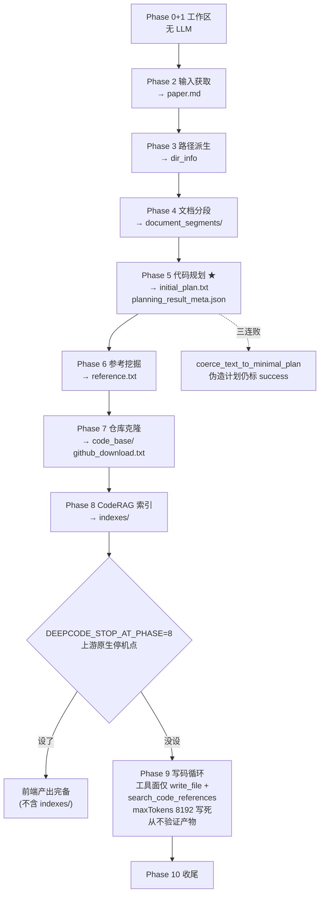

# DeepCode 内部机制:流水线、文件合同与可切分点

> 2026-09-03 · 面向「把 DeepCode 前半段切出来当语料/规划前端」这个具体目标
> 版本:上游 `HKUDS/DeepCode @ e0767d0` + 本仓库 `patches/deepcode_local_changes.patch`
> **所有断言都用两类证据核实过**:源码 `文件:行号`,以及 31 个真实归档任务目录、2,443 次工具调用日志
> (`deepcode_test/{fre,rice}/task_archives/*/logs/mcp.jsonl`)。与本文冲突的旧描述以本文为准。

本文回答四个问题:①每个 Phase 做什么、产出什么;②`task_dir` 的文件合同长什么样;
③哪里调 LLM、配置怎么流进去;④要单独跑前半段该怎么做、有哪些坑。

---

## 1. 十一个 Phase 的实际职责

入口是 `workflows/agent_orchestration_engine.py:1950 execute_multi_agent_research_pipeline`。
Phase 编号来自源码里的注释标记(`:1988`–`:2199`)。

| Phase | 行号 | 职责 | 调 LLM | 产出 |
| --- | --- | --- | --- | --- |
| 0+1 | 1988 | 建工作区、任务目录、任务 ID | 否 | `deepcode_lab/tasks/paper_<id>/` |
| 2 | 2019 | 输入获取(PDF/URL/本地文件 → 标准化) | 否 | `paper.md` |
| 3 | 2029 | 工作区基础设施合成,派生全部路径 | 否 | `dir_info` 字典(见 §2.2) |
| 4 | 2038 | 文档分段与预处理 | **是** | `document_segments/` |
| 5 | 2091 | **代码规划**(核心) | **是** | `initial_plan.txt`、`planning_result_meta.json`、`planning_attempts.jsonl` |
| 6 | 2121 | 参考文献情报(挖掘论文引用的仓库) | **是** | `reference.txt` |
| 7 | 2137 | 仓库获取自动化(git clone) | **是** | `github_download.txt`、`code_base/<repo>/` |
| 8 | 2154 | 代码库情报编排(CodeRAG 索引) | **是** | `indexes/*_index.json`、`codebase_index_report.txt` |
| **停机点** | **2162** | `DEEPCODE_STOP_AT_PHASE=8` → 在此干净退出 | — | 前面全部产物保留 |
| 9 | 2184 | **代码实现合成**(写码循环) | **是** | `generate_code/`、`implement_code_summary.md`、`code_implementation_report.txt` |
| 10 | 2199 | 收尾 | 否 | — |

Phase 6/7/8 只在 `enable_indexing=True` 时执行(`--fast` 会跳过)。

**注意一个反直觉的不对称**:`enable_indexing=True`(完整模式)下写码 agent 只有 2 个工具;
`False`(fast)反而有 11 个。见 §3.2。

---

## 2. 文件合同

### 2.1 `task_dir` 的实际内容

取自一个完整成功轮(`deepcode_test/rice/task_archives/archive_task_paper_ddaecdf1_0830_0724/`):

```
paper.md                        106 KB   Phase 2 产出,标准化后的论文正文
document_segments/                       Phase 4 产出,分段结果
initial_plan.txt                 22 KB   Phase 5 产出 ★ 复现计划(YAML 风格),含文件树
planning_result_meta.json       807 B    Phase 5 产出 ★ 计划来源与完整度(见 §2.3)
planning_attempts.jsonl         673 B    Phase 5 产出,三次尝试的逐条记录
reference.txt                    17 KB   Phase 6 产出 ★ 精选参考仓库报告(JSON)
github_download.txt             330 B    Phase 7 产出,每行 "<url>: success|failed"
code_base/<repo>/                        Phase 7 产出,克隆下来的参考仓库
indexes/<repo>_index.json                Phase 8 产出 ★ CodeRAG 卡片库
indexes/indexing_{statistics,summary}.json
codebase_index_report.txt       925 B    Phase 8 产出
generate_code/                           Phase 9 产出 ★ 最终代码
implement_code_summary.md       110 KB   Phase 9 产出,写码过程摘要
code_implementation_report.txt  4.8 KB   Phase 9 产出
logs/llm.jsonl, logs/mcp.jsonl           全程 LLM 与工具调用日志(排障主力)
logs/mcp_server_*.log                    各 MCP 服务器日志
```

★ = 把前半段当前端用时,你要消费的五样东西。

### 2.2 路径合同(代码层)

派生逻辑集中在 `workflows/workflow_context.py:95-135`,以属性形式给出:

```python
reference_path          → task_dir / "reference.txt"
initial_plan_path       → task_dir / "initial_plan.txt"
download_path           → task_dir / "github_download.txt"
index_report_path       → task_dir / "codebase_index_report.txt"
implementation_report_path → task_dir / "code_implementation_report.txt"
```

`to_dir_info()` 把它们打包成阶段之间传递的字典,键为:
`paper_dir` / `standardized_text` / `reference_path` / `initial_plan_path` /
`download_path` / `index_report_path` / `implementation_report_path` / `workspace_dir`
(外加 Phase 4 写回的 `segments_ready`)。

**这就是"文件合同"** —— 前后半段的唯一耦合就是这几个路径,所以切分点很干净。

### 2.3 `planning_result_meta.json`:必须检查的闸门

```json
{"source": "generated", "attempts": 1, "completeness_score": 0.93, ...}
```

`source` 只有两种值:

- `generated` —— 真实规划产物,可用
- `coerced_from_freeform` —— **规划三连败后,上游用 `planning_runtime.py:174 coerce_text_to_minimal_plan`
  把残骸包装成一个通用脚手架计划,并照样标 `status=success`、`completeness_score=1.0`**

31 个归档里出现过 1 次。流水线对此毫无察觉,会照着假计划写出空壳提交。
**任何消费 `initial_plan.txt` 的代码都必须先验 `source == "generated"`**,
`deepcode_test/scripts/run_trial.sh` 的假计划闸就是干这个的。

---

## 3. LLM 在哪里被调用

### 3.1 配置流

```
~/.deepcode/deepcode_config.json
  ├─ providers.profiles.<name>   apiBase / apiKeyEnv / manualModels
  ├─ agents.defaults             provider / model / maxTokens   → phase="planning"
  └─ agents.implementation       model / maxTokens / temperature → phase="implementation"
~/.deepcode/credentials.json
  └─ connections.<name>          实际 API key
```

`core/llm_runtime.py:110 attach_workflow_llm(agent, phase=..., ...)` 是唯一入口,
**`phase` 只有两个取值**:`"planning"`(Phase 4/5/6/7/8 共用)与 `"implementation"`(Phase 9)。
所以"规划用 A 模型、写码用 B 模型"是配置层就支持的;更细的粒度没有。

日志里每次挂载都会打印:
`Attached workflow LLM: agent=<Name> phase=<planning|implementation> provider=<...> model=<...>`
—— 排查"这一步到底用了哪个模型"直接 grep 这行。

### 3.2 各 agent 的请求参数(注意默认值差异极大)

| Agent | 位置 | maxTokens | max_iterations |
| --- | --- | --- | --- |
| 代码规划(Phase 5) | `:711-715` | 走 `agents.defaults` | 走参数 |
| GitHub 下载(Phase 7) | `:1041,1045` | `DEEPCODE_DOWNLOAD_MAX_TOKENS`(上游写死 4096) | 40 ← **本地改动**,上游无(默认 8) |
| 参考挖掘(Phase 6) | `:1121,1131` | `DEEPCODE_REFERENCE_MAX_TOKENS`(上游写死 **4096**) | 80 ← **本地改动**,上游默认 8 |
| 对话式规划 | `:1896` | 8192 写死 | — |
| 写码(Phase 9) | `code_implementation_workflow.py:989` | **8192 写死**,不读配置 | `_MAX_ITERATIONS = 800`(`:90`) |

**写码 agent 的 `maxTokens=8192` 是硬编码的**,`agents.implementation.maxTokens` 设多大都没用 ——
这是推理型模型在写码阶段被截断的直接原因。

### 3.3 写码 agent 的工具面(Phase 9)

`code_implementation_workflow.py:65-89`:

```python
_STANDARD_TOOL_NAMES = [read_file, read_multiple_files, read_code_mem, write_file,
                        write_multiple_files, execute_python, execute_bash,
                        get_file_structure, search_code_references,
                        get_indexes_overview, set_workspace]     # 11 个
_INDEXED_TOOL_NAMES  = [write_file, search_code_references]      # 2 个
```

`:820` 按 `enable_indexing` 二选一。**开索引时,`execute_python` / `execute_bash` 直接不在工具面里** ——
这不是模型"没想到去验证",是它根本看不到验证工具。

---

## 4. 实证:31 个归档里流水线到底干了什么

统计口径:全部 `task_archives/*/logs/mcp.jsonl`,**2,443 次工具调用,26 种工具**。

| 工具 | 次数 | 说明 |
| --- | --- | --- |
| `fetch` | 1,288 | 抓网页(参考挖掘阶段为主) |
| `write_file` | 478 | 写代码 |
| `search_code_references` | 144 | **CodeRAG 检索,只占 write_file 的 30%** |
| `git_clone` | 106 | 克隆参考仓库 |
| `read_document_segments` | 105 | 读论文分段 |
| `execute_commands` | 16 | 全是 `mkdir -p` + `touch` 建空骨架 |
| `execute_bash` | 23 | 全是 `find`/`ls`/`cat`/`grep`/`sed`/`pwd`/`head` |
| `execute_single_command` | 11 | 全是 `find . -type f -o -type d \| sort` |

### 4.1 关键事实:执行能力可用,但从不用于验证

50 次执行类调用,**没有一次运行过生成的代码**:全库 grep 不到任何
`python`、`pytest`、`pip install`、`import` 检查、`bash *.sh`。它们的用途只有两个:

1. **建空文件骨架** —— `mkdir -p configs data models …` + `touch models/fre_encoder.py …`
2. **列目录核对** —— `find . -type f -o -type d | sort`

这比"从不调用执行器"更能说明问题:**能力是有的,只是从不用于验证自己写的东西。**

> 勘误:本项目早期文档写作「`command_executor` 一次都没被调用」,该表述不准确,已在
> `fre/RESULTS.md`、`release/README.md`、`ARCHITECTURE_PROPOSAL_v0.1.md` 与汇报页更正。

### 4.2 各阶段的已知失败模式

| 阶段 | 失败模式 | 实证 | 表现 |
| --- | --- | --- | --- |
| 5 规划 | 三连败 → 伪造计划 | 1/31 归档 `source=coerced_from_freeform` | 标 success、completeness 1.0,写出空壳 |
| 5 规划 | 漏掉高权重组件 | fre trial1/trial5 | 三个对比基线全 0 分 |
| 6 挖掘 | 报告超 `maxTokens` 被截断,续写只留尾段 | fx1 首跑 | 下载侧只看见 1/5 仓库 |
| 8 索引 | 预筛响应截断 → JSON 解析失败 | 60 次 `will analyze all files` | 静默回退全量索引 |
| 8 索引 | 预筛返回**合法空列表** | fx2 D4RL 163 文件 | 与"调用失败"共用分支,同样回退全量 |
| 9 写码 | `maxTokens=8192` 硬编码 | 推理模型 | 输出截断 → 空响应 → stall 熔断 |
| 9 写码 | 不验证产物 | 见 §4.1 | 语法/可运行性无人把关 |

前四条的完整证据链在 `FINDING_prefilter_silent_failure.md`,共同模式见
`FINDING_generic_pipeline_failures.md`。

---

## 5. 怎么只跑前半段(切成语料/规划前端)

### 5.1 上游自带停机点

`agent_orchestration_engine.py:2162`(**上游原生,不是本地改动**,`git show HEAD:` 可验):

```python
if os.getenv("DEEPCODE_STOP_AT_PHASE") == "8":
    # 干净退出,Phase 1-7 输出全部保留在 task dir
```

所以:

```bash
DEEPCODE_STOP_AT_PHASE=8 <驱动脚本>
```

会跑完 Phase 0–7 后停,拿到 `paper.md`、`document_segments/`、`initial_plan.txt`、
`planning_result_meta.json`、`reference.txt`、`github_download.txt`、`code_base/`,
**但不含 `indexes/`**(Phase 8 本身被跳过)。

要连 CodeRAG 索引一起拿到、只跳过写码,需要在 `:2184` 之前照 `:2162` 的写法再加一个
`== "9"` 分支(约 5 行)。上游没有提供这个值。

### 5.2 驱动方式

不要用 `deepcode test <paper>` —— 它引用的 `test_paper.py` 在仓库里根本不存在(上游帮助文本漂移)。
直接调用官方管道函数,本仓库的 `scripts/stage_b_driver.py` 就是这么做的:

```python
from workflows.agent_orchestration_engine import execute_multi_agent_research_pipeline
result = await execute_multi_agent_research_pipeline(
    input_source=<paper.md 路径>, logger=logger, enable_indexing=True)
```

必需的环境变量:`STAGE_B_INPUT`(论文路径)、`STAGE_B_SLUG`(用于分离 `/tmp` 交接文件,
防止跨论文读到上一篇的 stale 路径)。

### 5.3 前置条件(缺一不可)

1. **7 个 MCP 服务器**必须配在 `~/.deepcode/deepcode_config.json` 的 `tools.mcpServers`:
   `code-implementation`、`code-reference-indexer`、`document-segmentation`、
   `filesystem`、`fetch`、`github-downloader`、`command-executor`。
   `deepcode init` 生成的配置**不含这些**,缺了会让所有 agent 零工具空转。
   自研服务器必须用 `python -m tools.xxx` 模块方式启动(直接跑脚本会 `ModuleNotFoundError: core`)。
2. **`agents.*.maxTokens ≥ 32768`**,否则推理模型在规划阶段就被截断。
3. **反抄袭封锁**:下载 agent 会自主选中论文官方仓库。用 `git config --global url.<blocked>.insteadOf`
   挡 git 协议,再用 `DEEPCODE_URL_DENYLIST` 挡 HTTP 抓取(论文 §4.1 声称有黑名单机制,
   但开源代码里没有实现,这条是本仓库补的)。

### 5.4 消费产出时必须做的校验

| 检查 | 为什么 |
| --- | --- |
| `planning_result_meta.json.source == "generated"` | 否则是伪造计划(§2.3) |
| `github_download.txt` 的 success 数 == `reference.txt` 里的候选数 | 报告截断会让下载侧只看见部分 URL |
| `reference.txt` 能完整 JSON 解析、`"rank"` 计数 == 预期 | 截断后只剩尾段 |
| `indexes/` 里每个仓库都有 `_index.json` | 缺失说明该仓库索引失败 |
| 日志里 `will analyze all files` 的次数 | >0 表示预筛失效、该仓库是全量索引(慢且贵,但不丢信息) |

### 5.5 本地改动对前半段的影响(用它当前端时必须知道)

以下是**未经 env 门控**的本地改动,即"默认行为"已不等于上游
(完整清单与逐条核验见 `REVIEW_local_changes_2026-09-03.md`):

| 落在哪 | 上游 | 本地 |
| --- | --- | --- |
| Phase 6 参考挖掘 | `maxTokens=4096`、`max_iterations=8` | 8192(env 可调)、80 |
| Phase 7 下载 agent | 原版提示词、无 tool_filter、`max_iterations=8` | 提示词重写、加 tool_filter、40、失败后二次纠错调用 |
| Phase 4 分段 | 原版提示词 | 加了一整段 "CRITICAL: You MUST invoke …" |
| `fetch` 工具 | 无限制 | 同一 URL 成功 2 次后拒绝第 3 次 |
| 工具名 | `mcp_github-downloader_git_clone` | 连字符消毒为下划线(Kimi 对含连字符的工具名会静默不调用) |
| 空 `code_base` | 继续 | fail-fast 抛 `RuntimeError` |
| Phase 9 墙钟 / stall | 7200 / 300 | 14400 / 1800 |

要严格对齐上游,用 `git stash` 或从 `e0767d0` 重新检出后只打你需要的补丁。

---

## 6. 一张图



---

## 7. 给自建复现 agent 的取用建议

**值得复用的**:Phase 6+7+8(参考挖掘 → 克隆 → CodeRAG 索引)。这是 DeepCode
唯一被数据证实的长处 —— 环境/数据集维度普遍占优。用 `DEEPCODE_STOP_AT_PHASE=8`
拿产物,按 §5.4 校验后喂给自己的循环。

**Phase 5 的计划**可以当**第二意见**(它的文件树往往考虑得比较全),但不要当权威:
它一次定死、漏了补不回来,且有伪造风险。

**Phase 9 整体不建议复用**:两个工具的工具面、8192 写死、800 迭代常量、
从不验证产物 —— 这四条决定了它的上限,补丁救不了,需要自己写循环。

架构层面的取舍见 `ARCHITECTURE_PROPOSAL_v0.1.md`。
