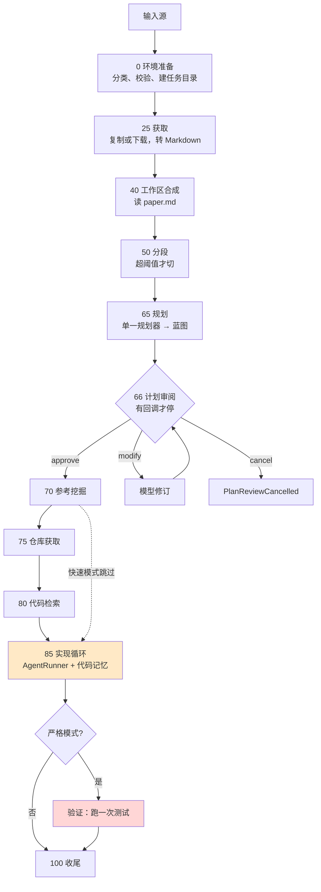

# 逻辑文档

本文说明复现管线怎么工作：十一个步骤各做什么、三个核心机制怎么实现、开关怎么影响流程、以及代码与论文（arXiv 2512.07921）的对应和差距。

词汇按 [CONTEXT.md](../CONTEXT.md)。产物格式在 [ARTIFACTS.md](ARTIFACTS.md)，接缝在 [INTEGRATION.md](INTEGRATION.md)。

## 1. 总览

入口是 `workflows/agent_orchestration_engine.py` 的 `execute_multi_agent_research_pipeline`。它是一个普通的 async 函数，按固定顺序调用十一个步骤，每步的进度百分比写死。步骤之间通过任务目录里的文件传递状态，不通过内存对象。

橙色是唯一跑多轮工具循环的步骤；红色是验证，它的结果不回流。

## 2. 十一步总表

| 进度 | 步骤 | 函数 | 调模型 | MCP 服务器 | 读 | 写 | 失败处理 |
| --- | --- | --- | --- | --- | --- | --- | --- |
| 1, 4 | 环境准备 | `environment.prepare_workflow_environment` | 否 | 无（改 `filesystem` 的 args） | 配置 | 任务目录 | 抛 `ValueError` |
| 25 | 获取 | `acquire_input_artifact` | 否 | 无（直接调 `tools/pdf_downloader.py` 函数） | 输入源 | `paper.*`、`paper.md` | 抛 `RuntimeError` |
| 40 | 工作区合成 | `synthesize_workspace_infrastructure_agent` | 否 | 无 | `paper.md` | 内存 `dir_info` | 抛 `ValueError` |
| 50 | 分段 | `orchestrate_document_preprocessing_agent` | 是，1 轮 | `document-segmentation` | `paper.md` | `document_segments/` | 降级为全文模式，不抛 |
| 65 | 规划 | `orchestrate_code_planning_agent` → `run_code_analyzer` | 是，≤3 次重试 | 无 | `paper.md` 或分段索引 | `initial_plan.txt` 及三个元数据文件 | 严格模式抛；否则机械转最小蓝图 |
| 66 | 计划审阅 | `plan_review_runtime.run_plan_review_gate` | 修订时是 | 无 | 蓝图 | `plan_versions/`、历史 | `cancel` 抛 `PlanReviewCancelled` |
| 70 | 参考挖掘 | `orchestrate_reference_intelligence_agent` → `paper_reference_analyzer` | 是 | `filesystem`、`fetch` | `paper.md` | `reference.txt` | 已存在则复用；异常向上抛 |
| 75 | 仓库获取 | `automate_repository_acquisition_agent` → `github_repo_download` | 是 | `filesystem`、`github-downloader` | `reference.txt` | `code_base/`、`github_download.txt` | 异常写进文件，不抛 |
| 80 | 代码检索 | `orchestrate_codebase_intelligence_agent` → `run_codebase_indexing` | 是，每文件 2 次 | 无（直接调 `CodeIndexer`） | `code_base/`、蓝图 | `indexes/`、报告 | 异常写进报告，不抛 |
| 85 | 实现循环 | `synthesize_code_implementation_agent` → `CodeImplementationWorkflow.run_workflow` | 是，≤800 轮 | `code-implementation`、`command-executor`，索引模式再加 `code-reference-indexer`、`document-segmentation` | 蓝图、索引 | `generate_code/`、代码记忆、报告 | 状态进返回值，不抛 |
| 85 | 验证 | `CodeImplementationWorkflow._verify_generated_code` | 否 | 无 | `generate_code/` | 返回值 `verification` | 失败标 `incomplete`，不重试 |
| 100 | 收尾 | 引擎尾部 | 否 | 无 | 各报告 | 返回字典 | — |

## 3. 各步骤详述

### 3.0 环境准备

`workflows/environment.py`。做四件事：把输入源规范化（去空白、`file://` 解码、`~` 展开、相对路径转绝对）并按扩展名判定输入种类；本地文件检查存在、是普通文件、不超过 `max_input_mb`；决定任务目录（给了 `task_id` 且目录已存在则进入 resume）；把工作区路径追加进 `filesystem` MCP 服务器的 `args`。URL 不做任何网络探测，理由写在代码注释里：arXiv 等站点拒绝 HEAD 请求，提前探测只会带来偶发失败。

### 3.1 获取

`acquire_input_artifact`。URL 走 `download_file_to`，本地走 `move_file_to`（实际是复制）。目标文件名固定 `paper.<原扩展名>`。两条路都以 `perform_document_conversion` 收尾，三级降级：装了 Docling 用 Docling；否则 PDF 走 pypdf 逐页抽文本；其余格式走 `tools/document_conversion.py` 的纯标准库转换器，HTML 剥掉脚本样式，DOCX 用 `zipfile` 加 `ElementTree` 读段落标题表格。格式识别靠 magic bytes 优先于扩展名。

下载的安全措施：自定义 DNS 解析器只接受公网 IP；拒绝带凭据的 URL；手动跟随重定向最多 5 跳每跳重新校验；流式写入 `.part` 文件超过 100 MiB 中止，成功后原子重命名。

收尾时 `_record_acquired_artifacts` 要求任务目录里至少有一个 `.md`，否则抛错。

### 3.2 工作区合成

名字很大，实际只是读 `paper.md`、按标题切成段落结构、标准化成文本放进 `dir_info`。无模型、无工具。

### 3.3 分段

`utils/llm_utils.should_use_document_segmentation` 判断文档字符数是否超过阈值（默认 50000）。超过则 `DocumentSegmentationAgent` 起一个 Agent，连 `document-segmentation` 服务器，让模型调 `analyze_and_segment_document` 工具。工具本身是确定性的，模型在这里只是一个触发器，白花一轮。分段失败降级为全文模式，不中断。

分段策略在第 5 节。

### 3.4 规划

`run_code_analyzer`。这是论文"蓝图生成"阶段在代码里的全部。细节在第 4.1 节。

### 3.5 计划审阅

只在传了 `plan_review_callback` 时发生。管线把蓝图和校验结果打包成请求交给回调，回调返回 `approve` / `modify` / `replace` / `cancel` / `skip`。`modify` 附反馈文本，管线调模型修订蓝图（`revise_plan_with_feedback`），存一个新版本再问一次，最多 3 轮。`replace` 直接用回调给的文本，校验通过才接受。每个事件记进 `plan_review_history.jsonl`。

### 3.6 参考挖掘

`paper_reference_analyzer`。一个 Agent，系统提示是 `PAPER_REFERENCE_ANALYZER_PROMPT`，连 `filesystem`（只开放 `read_text_file`、`list_directory`）和 `fetch`。消息让它读论文的参考文献部分，找出 5 个有 GitHub 仓库的最相关引用。输出是自由文本，存 `reference.txt`。文件已存在直接复用。

### 3.7 仓库获取

`github_repo_download`。另一个 Agent，连 `filesystem` 和 `github-downloader`，把上一步的自由文本原样作为消息，让模型调 `download_github_repo` 克隆到 `code_base/`。前面有一句 `await asyncio.sleep(5)`，注释说是"为了稳定"。

### 3.8 代码检索

`run_codebase_indexing` → `tools/code_indexer.CodeIndexer`。细节在第 4.3 节。`code_base/` 不存在或为空则跳过。

### 3.9 实现循环

`CodeImplementationWorkflow.run_workflow`，`pure_code_mode=True`。分两段：

先建文件树。一个 Agent 连 `command-executor`，系统提示 `STRUCTURE_GENERATOR_PROMPT`，让模型把蓝图的 `file_structure` 翻译成 `mkdir` / `touch` 命令并执行。这一步之后生成代码目录里已经有全部空文件。

再逐个填内容。`_run_kernel_implementation` 构造 `AgentRunSpec` 交给 `AgentRunner`。工具面按模式选：标准模式给 `read_file`、`read_multiple_files`、`read_code_mem`、`write_file`、`write_multiple_files`、`execute_python`、`execute_bash`、`search_code`、`get_file_structure`；索引模式只给 `write_file` 和 `search_code_references`。上限 800 轮、7200 秒。细节在第 4.2 节。

### 3.10 验证

仅严格模式。`support/verification.py` 在生成代码目录（经 `resolve_project_root` 下探一层）里机械发现测试命令：有 Python 测试布局就 `python3 -m pytest -q`（或 `unittest discover`）；`package.json` 有真实 `test` 脚本就 `npm test`；有 `Cargo.toml` 就 `cargo test`。每条跑一次，300 秒超时，进程组清理，stdout 和 stderr 各留末尾 64 KiB。全过才算 `completed`，否则 `unverified` 或 `test_failed`。

不重试，不把失败喂回实现循环。

### 3.11 收尾

拼摘要字符串，组返回字典，通过 `seams.sessions` 更新任务状态（本目录里是空操作）。

## 4. 三个核心机制

### 4.1 蓝图规划器

论文说 Concept Agent 和 Algorithm Agent 并行分析再由 Code Planning Agent 综合。代码里只剩一个规划器，`run_code_analyzer` 的注释说改成"单一权威规划器"是为了避免 fan-out 死锁。两个分析提示词还在 `prompts/code_prompts.py`，`get_adaptive_prompts` 也还返回它们，但没人调用。

规划器不连任何 MCP 服务器。输入按模式二选一：

- **分段模式**：`_load_document_segments_context` 从分段索引取 `code_planning` 相关性最高的分段，最多 8 段、24000 字符，拼成一段确定性上下文放进消息。提示词文本仍在教模型用 `read_document_segments` 工具，但工具不在。
- **全文模式**：整篇 `paper.md` 放进消息。

系统提示是 `CODE_PLANNING_PROMPT`（分段）或 `CODE_PLANNING_PROMPT_TRADITIONAL`（全文），要求输出五段式 YAML，每段有字符数指引（文件结构 800 到 1000，实现组件 3000 到 4000，等等）。

重试循环最多 3 次。每次结果过两道检查：`_assess_output_completeness` 打一个 0 到 1 的启发式分（五段各占 0.1，YAML 首尾完整加 0.2，末行不像截断加 0.15，长度分档加 0.05 到 0.15），`validate_plan_text` 用 PyYAML 解析并检查五个键。分数 ≥ 0.8 且校验通过才接受。不通过则 `_adjust_params_for_retry` 把 `max_tokens` 降到 `retry_max_tokens`、再降 90%、再降 80%，`temperature` 每次减 0.15。注释解释为什么是降不是升：超上下文的错误来自输入加输出总量，减输出才能给输入腾空间。

三次都失败：严格模式抛 `RuntimeError`；否则 `coerce_text_to_minimal_plan` 把最好的一次失败输出机械包成最小合法蓝图，`source` 记为 `coerced_from_freeform`。

每次尝试写一行 `planning_attempts.jsonl`，运行中的检查点写 `planning_checkpoint.json`，成功后删。

### 4.2 代码记忆

论文的 CodeMem。实现分三块：

**摘要生成**，`ConciseMemoryAgent.create_code_implementation_summary`。每次 `write_file` 成功后，用 `implementation` 阶段的 provider 单独调一次模型，提示词要求四段：Core Purpose、Public Interface、Internal Dependencies、External Dependencies，外加 Implementation Notes 和 Next Steps。提示词里附上已实现和未实现文件清单，强调 Next Steps 只能从未实现里选一个。结果追加进 `implement_code_summary.md`，Next Steps 剥掉存内存。

**清空策略**，`_ImplementationHook.after_iteration` → `apply_memory_optimization` → `create_concise_messages`。第一次 `write_file` 之前对话正常累积；之后每写完一个文件就把 `messages` 原地替换成三条：system 提示、一条含蓝图和文件清单的 user 消息、一条含最新一条摘要和"下一步"的 user 消息。历史工具结果全部丢弃。这就是论文说的"上下文规模与仓库规模解耦"。

**按需取回**，`read_code_mem` 工具。模型要实现新文件时可以传一组路径，工具从 `implement_code_summary.md` 里按 `## IMPLEMENTATION File <路径>` 锚切出对应段落返回。论文里的 `SelectRelevantMemory` 在代码里就是这个：系统只自动注入最新一条，其余靠模型自己决定读哪些。

围绕它的几个辅助：`_InstrumentedTool` 包住每个工具，记录写文件、喂循环检测器、维护进度；`LoopDetector` 在连续 5 次同名调用（写工具按参数分键）、单个文件超过 600 秒、或 300 秒没有进度时中止；每轮工具调用后追加一条引导 user 消息，成功版说"检查是否全部完成，否则 `read_code_mem` → `write_file`"，出错版说"先修错误"；`should_stop` 在未实现清单为空时返回完成。

### 4.3 代码检索

论文的 CodeRAG。`tools/code_indexer.CodeIndexer.process_repository` 对每个参考仓库三步：

1. **预筛**，`pre_filter_files`：把文件树和蓝图目标结构给模型，要它返回相关文件清单和置信度，低于 `min_confidence_score`（默认 0.3）的丢弃。这个提示词里有一句写死的"Focus on files related to recommendation systems, graph neural networks, and diffusion models"，是原项目遗留，对其他领域的论文是噪声。
2. **逐文件摘要**，`analyze_file_content`：每个入选文件调一次模型，得 `FileSummary`（主要函数、关键概念、依赖、一段摘要）。
3. **建关系**，`find_relationships`：把摘要和蓝图目标结构再给模型，要它输出到目标文件的关系列表，类型限四种、带置信度和用法建议。这对应论文的关系元组 (c'ₛ, ĉₜ, τ, σ, γ)。

结果存 `indexes/<repo>_index.json`。实现循环里模型通过 `search_code_references(indexes_path, target_file, keywords)` 查：工具加载全部索引，按目标文件路径和关键词打分取前 N 条，再列出指向该目标文件的直接关系，格式化成文本返回。

论文里的自适应检索门控 δ 在代码里没有独立实现，就是"模型愿不愿意调这个工具"。索引模式的引导消息把它标为 OPTIONAL。

## 5. 分段策略

`tools/document_segmentation_server.py`，全部规则，无模型。先判文档类型（按标题模式和关键词密度打分，得 `research_paper` / `technical_doc` / `algorithm_focused` / `general`），再按内容特征选策略：

| 条件 | 策略 |
| --- | --- |
| 研究论文且算法密度 > 0.3 | `semantic_research_focused`：按学术章节切，保留算法块完整 |
| 算法型或算法密度 > 0.5 | `algorithm_preserve_integrity`：识别算法块、公式链、概念组，相关块合并 |
| 概念复杂度 > 0.4 且实现细节 > 0.3 | `concept_implementation_hybrid`：概念和实现配对 |
| 超过 15000 字符 | `semantic_chunking_enhanced`：语义边界分块 |
| 其他 | `content_aware_segmentation`：按段落类型和重要性分块 |

每个分段算三个相关性分数（概念分析、算法提取、代码规划），基于内容类型和关键词。当前只有 `code_planning` 被规划步骤用到。

## 6. 四个开关

| 开关 | 位置 | 效果 |
| --- | --- | --- |
| `enable_indexing` | 管线参数 | `False` 为快速模式：跳过参考挖掘、仓库获取、代码检索，实现循环用标准工具面和 `GENERAL_CODE_IMPLEMENTATION_SYSTEM_PROMPT`。`True` 用索引工具面和 `PURE_CODE_IMPLEMENTATION_SYSTEM_PROMPT_INDEX` |
| `strict_outcomes` | 管线参数 | `True` 为严格模式：规划失败抛异常而不是机械兜底；实现完成后跑验证；无测试或测试失败判 `incomplete` |
| `plan_review_callback` | 管线参数 | 非 `None` 则在规划后停下等回调 |
| 自动分段 | 配置 `document_segmentation` | `enabled` 且文档超过 `size_threshold_chars` 才分段，决定规划器走分段模式还是全文模式 |

`task_id` 传已存在的值触发 resume：跳过获取，蓝图存在且校验通过则跳过规划，其余步骤照跑。

## 7. 与论文的对应

| 论文 | 代码 | 一致程度 |
| --- | --- | --- |
| 分层内容切分，标题作键 | 分段步骤 | 一致，且策略更多 |
| Concept Agent 与 Algorithm Agent 并行 | 无。提示词在，调用点没了 | 偏离 |
| 蓝图五段 | `initial_plan.txt` 五个必需键 | 一致 |
| CodeMem 条目：核心目的、公共接口、依赖边、下一目标 | 摘要提示词四段加 Next Steps | 一致 |
| SelectRelevantMemory | 自动注入最新一条，其余 `read_code_mem` 按需 | 选择权在模型 |
| 上下文与仓库规模解耦 | 每写一文件清空对话 | 一致 |
| CodeRAG 索引三步与关系元组 | `CodeIndexer` 三步、`FileRelationship` 五字段 | 一致 |
| 自适应检索门控 δ | 无独立实现 | 模型自决 |
| 中央编排 Agent 按状态选阶段 | 硬编码线性函数 | 偏离 |
| 静态分析 Agent、修改 Agent (Φ_LSP)、沙箱 Agent | 无 | 缺失 |
| 闭环 P'ⱼ₊₁ = Φ_LSP(P'ⱼ, T_error) | 验证只跑一次，不回流 | 缺失 |

## 8. 已知缺口

按对改造的影响排序。

**闭环纠错缺失。** 这是论文"阶段三"的核心，代码里没有。实证：EMA-Detect 那次运行生成 15 个文件，其中的测试 4 个失败，管线状态 `unverified`，模型从未看到失败输出。挂点在 `code_implementation_workflow._run_kernel_implementation` 的两个闭包：`should_stop` 现在在未实现清单为空时返回完成，改成"清单为空且验证全过"；`inject_followups` 现在只在还有文件没写时注入"继续"，加一个分支在验证失败时把 `stdout` / `stderr` 尾部注入。验证函数 `_verify_generated_code` 已经存在，可以直接在闭包里调。

**编排是硬编码的。** 论文说中央 Agent 按证据选择和重访阶段。代码是十一个 `await` 顺序排列，进度百分比字面量。要做自适应，得把 `execute_multi_agent_research_pipeline` 改成状态机或者让一个 Agent 决定下一步。步骤之间只通过文件通信，这一点对改造有利：每步都能独立重跑。

**并行分析被合并。** `PAPER_CONCEPT_ANALYSIS_PROMPT` 和 `PAPER_ALGORITHM_ANALYSIS_PROMPT` 及其全文变体都在，恢复的话要在 `run_code_analyzer` 里加两个 Agent 并把输出拼进规划器消息。原作者放弃它的理由是死锁，接入方的循环实现要注意并发时 MCP 会话的归属。

**检索门控是模型自决。** 索引模式下引导消息把 `search_code_references` 标为可选。要让检索可控，在 `_ImplementationHook.after_iteration` 里按目标文件查索引并主动注入是最直接的做法。

**分段步骤白花一轮模型调用。** `DocumentSegmentationAgent` 让模型去调一个确定性工具。直接调 `analyze_and_segment_document` 函数即可。

**索引器预筛提示词有遗留的领域偏置。** 见 4.3 第 1 步。

**规划器提示词与输入不一致。** 分段模式下提示词教模型用 `read_document_segments` 工具，但 Agent 不连任何服务器，模型看到的是拼好的上下文。有时模型会"推迟"给别的 Agent 去读，`_is_deferred_planning_output` 专门检测这种输出并兜底。
