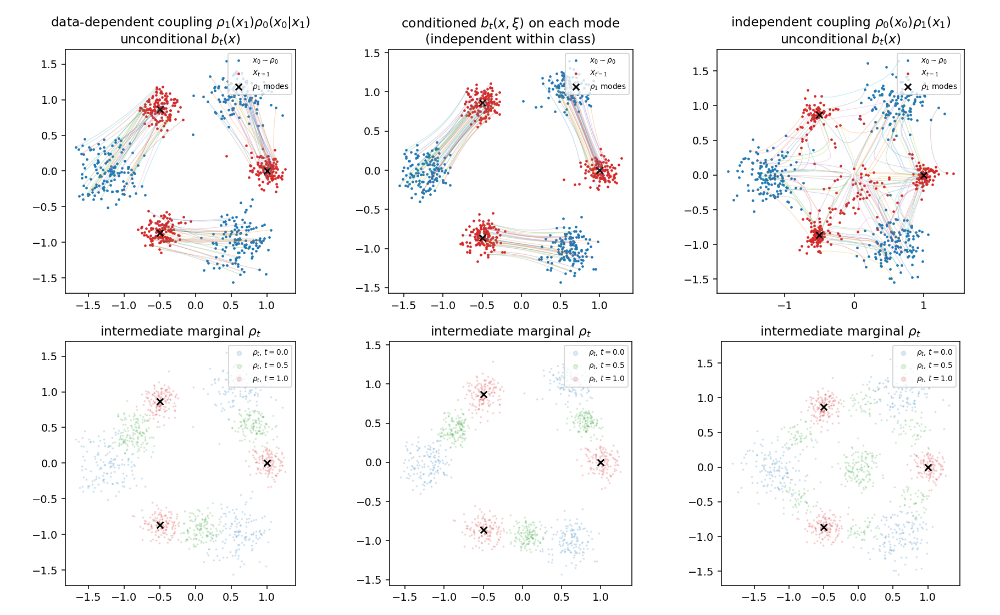
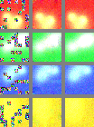
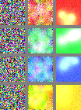
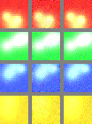
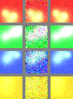

# Stochastic Interpolants with Data-Dependent Couplings - reproduction

Reproduction of

> M. S. Albergo\*, M. Goldstein\*, N. M. Boffi, R. Ranganath, E. Vanden-Eijnden,
> **Stochastic Interpolants with Data-Dependent Couplings**, ICML 2024.

The paper generalises the stochastic-interpolant framework so that the base
density is *coupled* to the target: instead of `rho_0(x_0) rho_1(x_1)` one
uses `rho_1(x_1) rho_0(x_0 | x_1)`.  The resulting interpolant
`I_t = alpha_t x_0 + beta_t x_1 + gamma_t z` still has a velocity and a score
that are the minimisers of simple quadratic objectives, and the couplings make
the transport cheaper and enable conditional generation tasks (in-painting,
super-resolution) that need no inference-time corrections.

This repository implements

1. **the framework and its theory** - Definition 3.1 / A.1, Theorem 3.1 / A.1
   (transport equation, `L_b` and `L_g` objectives, score identity),
   Corollary 3.1 / A.1 (probability-flow ODE and the forward/backward SDEs) and
   Proposition 3.1 (transport-cost bound);
2. **the couplings** - the independent baseline, the generic
   `x_0 = m(x_1) + sigma zeta` construction of Section 3.2, the
   data-decorruption coupling of Section 3.3, the in-painting coupling of
   Section 4.1 and the super-resolution coupling of Section 4.2, including
   conditioning on class labels and on image-shaped information `xi`;
3. **the experiments** - Algorithm 1 (training), Algorithm 2 (sampling), the
   DDPM U-Net of Appendix B with the exact hyper-parameters of the paper, the
   ImageNet data pipeline (HuggingFace), the FID-50k evaluation of Tables 2/3
   and the figure-generation utilities for Figures 1-6;
4. **numerical verification of the theory** that runs on CPU in minutes -
   Figure 2 (couplings vs conditioning on 3-mode Gaussian mixtures), the
   transport-cost comparison of Section 3.3 / eq. (21) and Proposition 3.1,
   plus a suite of unit tests that check every theoretical identity
   numerically.

Everything that does not require ImageNet-scale compute has been *run*; the
ImageNet runs are fully implemented but are meant to be executed on GPUs
(`200,000` gradient steps at batch size `32` per model, as specified in the
addendum).

---

## 1. Results obtained in this reproduction

### 1.1 Figure 2 - coupling is not the same as conditioning

`experiments/gmm_coupling.py` (run with `bash scripts/run_toy_experiments.sh`)
trains three velocity fields on two 3-mode Gaussian mixtures (a rotation plus
scale map `A` between the base and the target, base noise `sigma = 0.15`) and
reports the transport-cost bound of Proposition 3.1, the realised transport
cost of the learned ODE and the number of modes of the intermediate marginal
`rho_{t=1/2}` (local maxima of a kernel density estimate):

| setting | `int E|I_dot|^2 dt` (bound) | realised `E|X_1 - x_0|^2` | modes of `rho_{t=1/2}` |
|---|---|---|---|
| data-dependent coupling, unconditional `b_t(x)` | **1.321** | 1.288 | **3** |
| conditioned `b_t(x, xi)` (independent within class) | 1.312 | 1.247 | 3 |
| independent coupling, unconditional `b_t(x)` | 2.556 | 0.806 | **7** |

The coupled transport keeps exactly the three modes of the problem while the
uncoupled transport develops auxiliary modes (up to `3 x 3 = 9` are possible;
7 are resolved here) - this is the qualitative statement of Figure 2.  Note
that the *realised* cost of a learned model can be lower than the bound even in
the uncoupled case (0.806 <= 2.556); what the coupling controls is the bound
(Section 3.3), i.e. the cost and the complexity of the underlying transport,
which is what the first and the last columns show.



### 1.2 Section 3.3 and Proposition 3.1 - coupling lowers the transport cost

`experiments/transport_cost.py`:

**(a) Equation (21)**, data-decorruption coupling `x_0 = x_1 + sigma zeta`
(`sigma = 0.5`) versus the independent coupling with the same base marginal:

| `d` | coupled (Monte Carlo) | `d sigma^2` | independent (Monte Carlo) | `2 E|x_1|^2 + d sigma^2` |
|---|---|---|---|---|
| 2 | 0.502 | 0.500 | 4.486 | 4.481 |
| 8 | 1.994 | 2.000 | 17.962 | 17.979 |
| 64 | 16.005 | 16.000 | 143.960 | 144.049 |
| 256 | 64.013 | 64.000 | 575.788 | 575.976 |

**(b) Proposition 3.1** with the *exact* affine velocity of a Gaussian
coupling (the probability-flow ODE is then integrated to high accuracy):

| setting | `E|X_1(x_0) - x_0|^2` | bound `int E|I_dot|^2 dt` | inequality | `Var(X_1)` (target 1.0) |
|---|---|---|---|---|
| `d=2`, coupled | 0.0280 | 0.4991 | holds | 1.002 |
| `d=2`, independent | 0.0285 | 4.5156 | holds | 0.992 |
| `d=8`, coupled | 0.1126 | 1.9969 | holds | 1.008 |
| `d=8`, independent | 0.1148 | 18.119 | holds | 1.000 |
| `d=2`, coupled, *learned* velocity net | 0.0263 | 0.5056 | holds | 1.005 |
| `d=2`, independent, *learned* velocity net | 0.0339 | 4.5532 | holds | 1.023 |

The exact-velocity rows also confirm that the flow recovers the target
marginal (`Var(X_1) = 1`), i.e. that the velocity field really transports the
coupled base onto the target.

### 1.3 Section 4.1 / 4.2 - in-painting and super-resolution pipelines

`experiments/inpainting_demo.py` runs the *exact* procedures of Sections 4.1
and 4.2 (U-Net velocity model, 64-tile mask with `p = 0.3`,
`x_0 = xi o x_1 + (1 - xi) o zeta` for in-painting,
`x_0 = U(D(x_1)) + sigma zeta` with `xi = U(D(x_1))` for super-resolution,
velocity output masked to the missing region, `L_b` regression, ODE sampling)
on a small procedural image dataset, and compares the data-dependent coupling
with the uncoupled baseline (independent Gaussian base, the same conditioning
signal, the same mask / low-resolution input, the same architecture and the
same number of gradient steps).  Both models are deliberately under-trained
(200 and 150 steps) - the point is the structure of the comparison, not the
absolute numbers:

| task | model | metric | observed-pixel max error |
|---|---|---|---|
| in-painting | dependent coupling (ours) | masked MSE **0.0346**, PSNR **20.63** | **0.0** (exact by construction) |
| in-painting | uncoupled baseline | masked MSE 0.237, PSNR 12.27 | 2.0 (nothing pins the observed pixels) |
| super-resolution | dependent coupling (ours) | MSE **0.0144**, PSNR **24.45** | - |
| super-resolution | uncoupled baseline | MSE 0.0866, PSNR 16.65 | - |

Raw numbers are in `results/inpainting_demo.json` and
`results/super_resolution_demo.json`.






Every panel is laid out as in the paper: left = base sample `x_0` (masked
image with noise, or the low-resolution image), middle = model sample
`X_{t=1}`, right = ground truth.

---

## 2. Repository layout

```
si_couplings/
  interpolants.py   Definition 3.1 / A.1: schedules alpha, beta, gamma, the
                    process I_t, its velocity, the effective noise scale
                    gamma_tilde = alpha_t * sigma, and closed-form Gaussian
                    reference quantities (used by tests and experiments)
  couplings.py      Sections 3.2/3.3 and 4: IndependentCoupling,
                    GaussianAdaptedCoupling, DataDecorruptionCoupling,
                    InpaintingCoupling (64-tile mask), SuperResolutionCoupling
  losses.py         Theorem 3.1 / A.1: L_b (eq. 7 / 22), L_g, and
                    transport_cost_upper_bound (Proposition 3.1)
  solvers.py        Corollary 3.1: probability-flow ODE (self-contained
                    dopri5, Euler = Algorithm 2, Heun, optional torchdiffeq)
                    and the forward / backward SDEs
  train.py          Algorithm 1 with the Appendix-B optimiser recipe
                    (Adam 2e-4, StepLR 0.99 every 1000 steps, clip 10000, EMA)
  sample.py         Algorithm 2 and the task-specific samplers
  fid.py            Tables 2/3: FID-50k with an Inception-V3 feature extractor
  visualize.py      Figures 3-6: [base | sample | ground truth] panels and
                    temporal slices
  data/             ImageNet via HuggingFace (trust_remote_code=True), mask
                    sampling, super-resolution operators, and a synthetic
                    stand-in dataset for the smoke tests
  models/           Appendix-B DDPM U-Net (time + class + image-shaped
                    conditioning, output masking) and 2-D toy networks
configs/            one YAML per experiment: in-painting 256/512 (coupled and
                    baseline), super-resolution 64->256 (coupled and
                    baseline), 256->512, plus a CPU smoke configuration
scripts/            thin wrappers around the CLIs (train, FID, toy
                    experiments, smoke test)
experiments/        gmm_coupling.py (Figure 2), transport_cost.py
                    (Section 3.3 + Proposition 3.1), inpainting_demo.py
                    (Section 4.1 and, with --task super_resolution, 4.2)
tests/              pytest suite verifying the theory and the pipeline
docs/theory.md      statement-by-statement map from the paper to the code
results/            outputs produced by the runs above (figures + JSON)
```

`docs/theory.md` is the detailed map: every definition, theorem, corollary and
proposition of the paper is listed there together with the function that
implements it, the experiment that exercises it and the test that checks it.

---

## 3. Reproducing the ImageNet experiments

### 3.1 Data

ImageNet is loaded through HuggingFace, as suggested in the addendum:

```python
from datasets import load_dataset
dataset = load_dataset("imagenet-1k", trust_remote_code=True)
```

`si_couplings/data/imagenet.py` wraps this into a `torch.utils.data.Dataset`
returning `(image, label)` with the image in `[-1, 1]` (random-resized-crop and
horizontal flip for training, resize and centre crop for validation), which is
the range expected by the U-Net of Appendix B.

### 3.2 Training (Algorithm 1)

```bash
# in-painting on ImageNet-256x256
bash scripts/train_inpainting_256_coupled.sh     # Table 2, "Dependent Coupling (Ours)"
bash scripts/train_inpainting_256_baseline.sh    # Table 2, "Uncoupled Interpolant (Baseline)"
bash scripts/train_inpainting_512_coupled.sh     # Figure 3, bottom panels

# super-resolution
bash scripts/train_superres_64_256_coupled.sh    # Table 3, "Dependent Coupling (Ours)"
bash scripts/train_superres_256_512_coupled.sh   # Figure 6
```

Each run uses the numbers stated in the addendum (batch size 32, 200,000
gradient steps) and in Appendix B (Adam at learning rate `2e-4`, StepLR with
`gamma = 0.99` every `N = 1000` steps, no weight decay, gradient-norm clipping
at 10,000, U-Net with `dim = 256`, `dim_mults = (1, 1, 2, 3, 4)`, 8 GroupNorm
groups inside the ResNet blocks, learned sinusoidal time conditioning of
dimension 32, 4 attention heads of dimension 64, no random Fourier features,
class-label embeddings).  Manifests are written to `runs/<name>/train.jsonl`
and checkpoints (including EMA weights) to `runs/<name>/checkpoint_last.pt`.

### 3.3 Sampling and evaluation

```bash
# samples / panels (Figures 1, 3, 4, 5, 6)
python -m si_couplings.sample --config configs/inpainting_256_coupled.yaml \
    --checkpoint runs/inpainting_256_coupled/checkpoint_last.pt \
    --task inpainting --n 6 --out results/inpainting_samples.pt

# FID-50k (Tables 2 and 3)
bash scripts/evaluate_fid_inpainting.sh
bash scripts/evaluate_fid_superres.sh
```

`si_couplings/fid.py` implements FID with the standard 2048-d Inception-V3 pool
features and the 50,000-sample protocol; the reference ImageNet statistics are
cached next to the output file.

---

## 4. Tests and small-scale runs

```bash
pip install -r requirements.txt
python -m pytest tests -q                     # 34 tests, under a minute on CPU
bash scripts/smoke_test.sh                    # tests + a tiny train/sample run
bash scripts/run_toy_experiments.sh           # Figure 2 + Section 3.3 + Prop. 3.1
python experiments/inpainting_demo.py --steps 200 --out results
python experiments/inpainting_demo.py --task super_resolution --steps 150 --out results
bash scripts/run_all.sh                       # the above + the ImageNet runs (GPU)
```

The test suite covers

* the boundary conditions and shapes of Definition 3.1, the positivity
  condition `alpha^2 + beta^2 + gamma^2 > 0`, and the equivalence of the
  schedule printed in Section 4.1 with a time reversal of the default one;
* the structural property of the in-painting interpolant,
  `xi o I_t = xi o x_1` for all `t` (hence `b_t = 0` on the observed pixels),
  the 64-tile mask distribution, and `E|x_0 - x_1|^2 = d sigma^2` for the
  data-decorruption coupling;
* Theorem 3.1: the marginal of `I_t`, the identity
  `grad log rho_t = -gamma_t^{-1} g_t` (kernel-regression check),
  `b_t = E[I_dot | I_t = .]` (least-squares check), and the equivalence of the
  `L_b` objective with the MSE form;
* Corollary 3.1: the forward SDE transports base to target, the backward SDE
  transports target to base, and `eps_t = 0` reproduces the ODE;
* Proposition 3.1: the inequality `E|X_1 - x_0|^2 <= int E|I_dot|^2 dt` and
  recovery of the target marginal;
* the solvers (dopri5 against an analytic solution) and an end-to-end
  train/sample smoke test on synthetic images (in-painting and
  super-resolution, coupled and uncoupled).

The FID utilities are covered by tests that do not need Inception (analytic
Frechet distances and the statistics accumulator); the full
`python -m si_couplings.fid` path (dataset -> sampling -> Inception features ->
Frechet distance) has also been executed end to end on the synthetic dataset to
check that it runs, and it prints a warning when `n` is far below the 50,000
samples of the reference protocol.

---

## 5. Deviations, assumptions and conventions

* **`alpha_t`, `beta_t` for the in-painting experiment.**  Section 4.1 writes
  "we set `alpha_t = t` and `beta_t = 1 - t`".  That pair is the time-reversed
  labelling of the interpolant (it satisfies `alpha_1 = beta_0 = 1`, not the
  `alpha_0 = beta_1 = 1` of Definition 3.1) and it contradicts Algorithm 2,
  which initialises `X_0 = m(x_1) + sigma zeta` and integrates forward to the
  clean image.  We follow Definition 3.1 and Algorithm 2 and use
  `alpha_t = 1 - t`, `beta_t = t` everywhere; `LinearInterpolant(reverse=True)`
  reproduces the literal statement (the two differ by `t -> 1 - t`, so the
  learned transport is the same).
* **`attn_resolutions`.**  Appendix B lists the number of attention heads and
  their dimension, but not the resolutions at which full attention is
  inserted.  We insert full attention at the innermost resolutions (16x16 and
  32x32 for 256x256 images, matching the reference implementation's behaviour
  of using full attention only at the lowest resolution) and linear attention
  at every resolution.
* **Base distribution of the uncoupled baseline.**  The baseline is the
  standard stochastic interpolant, `x_0 ~ N(0, Id)` independent of `x_1`, with
  `gamma_t = sqrt(2 t (1 - t))`; for the in-painting comparison the *same*
  mask is used for both models, so the two differ only in the coupling.
* **The noise scale `sigma` of the couplings.**  The paper does not state a
  numerical value for the super-resolution noise scale.  We use
  `sigma = 0.5` for super-resolution and `sigma = 1` on the missing tiles for
  in-painting (i.e. `zeta ~ N(0, Id)`, exactly as written in Section 4.1);
  both are exposed in `configs/*.yaml`.
* **FID.**  The paper reports FID-50k.  `si_couplings/fid.py` implements the
  Frechet distance with the usual Inception-V3 features (images resized to
  299x299, normalised from the `[-1, 1]` model range); the baseline rows of
  Tables 2 and 3 are quoted from the paper, and the addendum explicitly puts
  the Improved DDPM / SR3 / ADM / Cascaded Diffusion / I^2SB baselines out of
  scope, so only our own two rows are reproduced here.
* **Compute.**  No GPU was available in the environment in which this
  reproduction was written, so the ImageNet runs are implemented and covered
  by unit and smoke tests but were not executed; everything reported in
  Section 1 was executed on CPU and the raw outputs are in `results/`.
